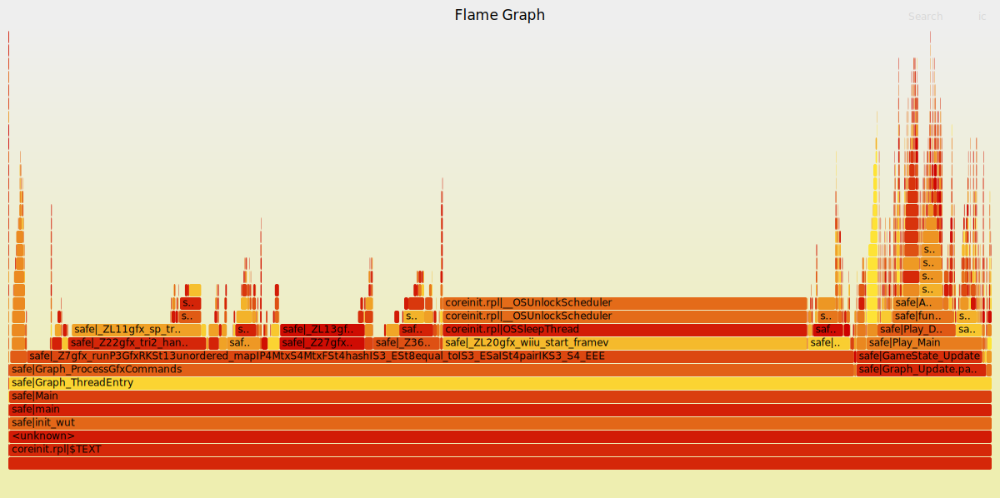

# FlameCafe
Wii U stack trace capture plugin for profiling with [FlameGraph](https://github.com/brendangregg/FlameGraph).

## Example
The following graph was created with the default settings (3 frames, 50 microseconds interval).  
You can click on the graph to zoom and interact with it.
[](https://garyodernichts.github.io/FlameCafe/graph.svg)

## Installation
(`[ENVIRONMENT]` is a placeholder for the actual environment name.)

1. Copy the file `FlameCafe.wps` into `sd:/wiiu/environments/[ENVIRONMENT]/plugins`.  
2. Requires the [WiiUPluginLoaderBackend](https://github.com/wiiu-env/WiiUPluginLoaderBackend) in `sd:/wiiu/environments/[ENVIRONMENT]/modules`.

## Usage
### Capture stacks

Via the plugin config menu (press L, DPAD Down and Minus on the GamePad, Pro Controller or Classic Controller) you can configure the plugin. The available options are the following:

- **Settings**: 
  - Enabled: (Default is true)
    - Enables or disables the plugin.
  - Amount of frames (Default is 3)
    - The amount of frames over which stacks are captured.
  - Capture interval (microseconds) (Default is 50)
    - The interval with which samples are captured in microseconds.
  - Button combination (Default is L + R)
    - The button combination which starts the capture.

Press the button combination to start a capture. The captures are saved to the `wiiu/FlameCafe` directory on the SD Card.

### Generate Flame Graph

Clone https://github.com/brendangregg/FlameGraph and use `flamegraph.pl` to render a SVG graph from one of the captures on the SD Card.

```
$ ./flamegraph.pl 2025-02-16_14-43-04.txt > graph.svg
```

(The captures are already in the correct format, running the stackcollapse programs is not necessary.)

## Building

For building you need: 
- [wups](https://github.com/wiiu-env/WiiUPluginSystem)
- [wut](https://github.com/decaf-emu/wut)
